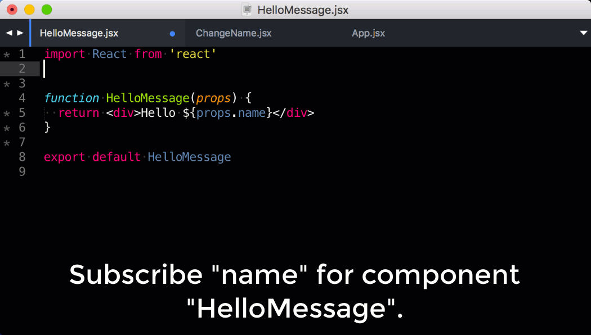

# Alfa

> Effortless React State Management.

[![CI status][ci-img]][ci-url]
[![License MIT][license-img]][license-url]
[![NPM version][npm-img]][npm-url]
[![Dependencies][dep-image]][dep-url]
[![Coverage Status][coverage-img]][coverage-url]
[![Code Climate][climate-img]][climate-url]



[](https://saucelabs.com/u/alfajs)

## Why Alfa?

[React](https://facebook.github.io/react/) is an excellent library for creating interactive and stateful views. However, things become unclear when you need to `share & change data across components`.

Alfa offers an **intuitive and straightforward way** to manage React state. It completely decouples the complex relationships between components and lets you focus on making **components that work anywhere**.

Its **simple** design allows you to adopt it in a matter of minutes while at the same time provides your essential tools to keep your application code easy to change and understand. Here is a list of things why it is the perfect fit for your next React app:

* **Easy** &ndash; Only 4 functions/APIs to learn.
* **Fast** &ndash; Alfa wraps your components with a thin layer. It introduces little to no performance impacts.
* **Small** &ndash; ~190LOC & 3KB minified + gzipped.
* **Async** &ndash; Alfa supports asynchronous operations natively without additional packages.
* **Explicit** &ndash; Alfa lets you know what a component requires **(input)** and what it changes **(output)**.
* **Transparent** &ndash; You can use and unit test your components as they are without Alfa. Users of your lib/component could but don't have to use Alfa at all.
* **React Native** &ndash; Supports React Native out of the box.
* **Server Render** &ndash; Supports isomorphic apps out of the box.
* **Production Ready** &ndash; 100% test coverage and being used in productions.

## Links

* [Documentation](https://lsm.github.io/alfa)
* [Hello World Example](https://github.com/lsm/alfa/tree/master/examples/hello)
* [TodoMVC Example](https://github.com/lsm/alfa/tree/master/examples/todomvc)

## Quick Guide

### Installation

Use `npm` to add it to your `package.json`.

```sh
npm install --save alfa
```

Alternatively, use `yarn` if you prefer:

```sh
yarn add alfa
```

### Getting Data for Components

Alfa converts your regular React component into a **dependency injected component** by `injecting` application data from a key/value store. Let Alfa handle the data if you use it in different components:

```jsx
// hello.js
import React from 'react'
import { subscribe } from 'alfa'

// A stateless functional component.
function HelloMessage(props) {
  // Data is injected as the property of props.
  return <div>Hello ${props.name}!</div>
}

export default subscribe(HelloMessage, ['name'])
```

`subscribe` makes a new component which gets the variable `name` and feeds it into the `HelloMessage` as `props.name` on (re-)rendering.

Now let's see how to use the above component in our app:

```jsx
// index.js
import React from 'react'
import { render } from 'react-dom'
import { provide, subscribe } from 'alfa'

import HelloMessage from './hello.js'

// Define the root app which renders HelloMessage as a child.
const App = () => (
  <div>
    <HelloMessage />
  </div>
)

// Create the Root component by wrapping the App component with initial data
// using `provide(Component, data)`.
const Root = provide(App, { name: 'Motoko' })

// Render it!
render(<Root />, document.getElementById('root'))
```

You don't need to pass the variable `name` to `HelloMessage` as Alfa gets it from the store and passes it to `HelloMessage` component automatically. It allows us to quickly move the component around without worrying about how to get the data it depends on.

### Changing Data

The simplest way to modify the data of the Alfa store is to inject the built-in `set` function to the component.

```jsx
// change.js
import { subscribe } from 'alfa'
import React, { Component } from 'react'

// A stateful class component.
class ChangeName extends Component {
  handleChange = event => {
    // Calling `set('mykey', 'my value')` will change the data `mykey`
    // in store to value `my value`.
    this.props.set('name', event.target.value)
  }

  handleSubmit = event => {
    event.preventDefault()
  }

  render() {
    return (
      <form onSubmit={this.handleSubmit}>
        <label>
          Name:
          <input
            type="text"
            value={this.props.name}
            onChange={this.handleChange}
          />
        </label>
      </form>
    )
  }
}

export default subscribe(ChangeName, ['set', 'name'], ['name'])
```

As mentioned earlier, Alfa makes things explicit. So we need to define the `output` (the 3rd argument when calling the `subscribe` function) of the component explicitly if we want to change a value of a key in the data store. Otherwise, Alfa complains that we are trying to use `set` without defining the correct `output`.

Now add the `ChangeName` component to `App` and your `index.js` ends up like this:

```jsx
// index.js
import React from 'react'
import { render } from 'react-dom'
import { Provider, subscribe } from 'alfa'

import HelloMessage from './hello.js'

const App = () => (
  <div>
    <HelloMessage />
    <ChangeName />
  </div>
)

// Alternatively, you can use Provider - the declarative interface of the
// provide function.
render(
  <Provider data={{ name: 'Motoko' }}>
    <App />
  </Provider>,
  document.getElementById('root')
)
```

Now each time you make a change in the input box, React will re-render both `HelloMessage` and `ChangeName` components to reflect the change.

You can find the finished version of the above example in the folder [`examples/hello`](https://github.com/lsm/alfa/tree/master/examples/hello).

Please check the documentation for [API](https://lsm.github.io/alfa/#/api) and [advanced usages](https://lsm.github.io/alfa/#/advanced_usage).

## License

MIT

[dep-url]: https://david-dm.org/lsm/alfa
[dep-image]: https://david-dm.org/lsm/alfa.svg
[dev-url]: https://david-dm.org/lsm/alfa?type=dev
[dev-image]: https://david-dm.org/lsm/alfa/dev-status.svg
[license-img]: https://img.shields.io/npm/l/alfa.svg
[license-url]: http://opensource.org/licenses/MIT
[npm-img]: https://badge.fury.io/js/alfa.svg
[down-img]: https://img.shields.io/npm/dm/alfa.svg
[npm-url]: https://npmjs.org/package/alfa
[ci-img]: https://circleci.com/gh/lsm/alfa/tree/master.svg?style=shield
[ci-url]: https://circleci.com/gh/lsm/alfa/tree/master
[travis-img]: https://travis-ci.org/lsm/alfa.svg?branch=master
[travis-url]: http://travis-ci.org/lsm/alfa
[coverage-img]: https://coveralls.io/repos/github/lsm/alfa/badge.svg?branch=master
[coverage-url]: https://coveralls.io/github/lsm/alfa?branch=master
[climate-img]: https://codeclimate.com/github/lsm/alfa/badges/gpa.svg
[climate-url]: https://codeclimate.com/github/lsm/alfa
